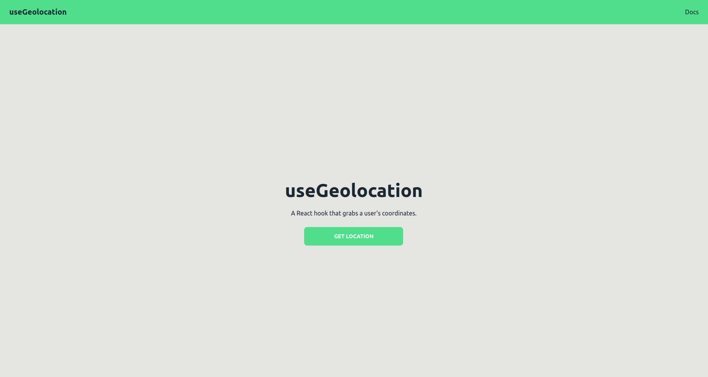

# useGeolocation

A react app using the [useGeolocation](https://github.com/streamich/react-use/blob/master/docs/useGeolocation.md) hook from [react-use](https://github.com/streamich/react-use).

Has some basic error handling: 

Styled with [daisyUI](https://daisyui.com/). 

---

Clone me and then run me using `npm start`
